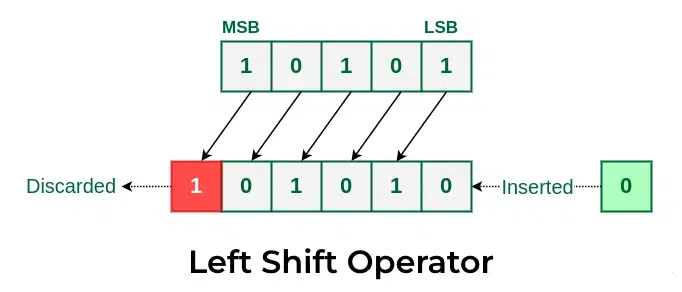
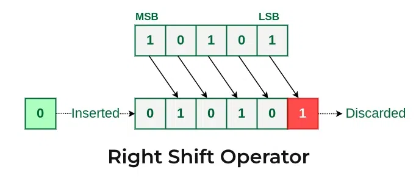

# 1. Variables

## What Are Variables?
- **Definition**: Variables are named memory locations used to store data values during the execution of a program.
- **Purpose**: They allow programs to manipulate and store data for computations.

## Declaration and Initialization

- **Declaration**: Declares a variable's name and typ, the syntax for the same is given below: 
  
  > datatype variable_name;
  - Example:  `int age;`
- **Initialization**: Assigns an initial value to the variable at the time of declaration or later.
  - Example: `int age = 25;`

## Types of Variables
### Based on Scope and Storage
1. **Local Variables**:
   - Declared inside a function or block.
   - Accessible only within that function or block.
   - Not initialized by default; must be explicitly initialized.

2. **Global Variables**:
   - Declared outside all functions.
   - Accessible throughout the entire program.
   - Default value is zero if not initialized.

3. **Static Variables**:
   - Retain their value between function calls.
   - Declared using the `static` keyword.
   - Example: `static int count = 0;`
   - Their implementation will be discussed during the implimentation of functions

4. **Extern Variables**:
   - Declared using the `extern` keyword.
   - Used to reference global variables defined in another file.

## Variable Naming Rules
1. Must begin with a letter or an underscore (`_`).
2. Cannot contain spaces or special characters.
3. Cannot use C keywords as variable names.
4. Case-sensitive (`age` and `Age` are different).

>Refer the `2_variables.c` for the implentation of these variables.

### Data types in C 

### Data Types in C and Their Storage

### Data Types in C and Their Storage

| Data Type | Description                  | Space Occupied |
|-----------|------------------------------|----------------|
| `int`     | Integer                      | Typically 4 bytes |
| `char`    | Character                    | 1 byte         |
| `float`   | Floating-point number        | 4 bytes        |
| `double`  | Double precision float       | 8 bytes        |
| `short`   | Short integer                | 2 bytes        |
| `long`    | Long integer                 | Typically 8 bytes |
| `void`    | None - Not Specified | 0 bytes        |

### Format Specifiers:
A format specifier as the name suggests, used to specify the type and format of data being processed. It tells the compiler how to interpret and handle the corresponding variable. For instance, `%d` represents a signed integer, `%f` is for floating-point numbers, and `%c` is for characters. Format specifiers ensure that data is displayed or read correctly, aligning the program's expectations with the actual data type of the variable. They can also be combined with modifiers to control the width, precision, or alignment of the output, providing flexibility in formatting.

**Commonly used format specifier is tabularized below**

| Format Specifier | Data Type                | Example Usage         |
|-------------------|--------------------------|-----------------------|
| `%d`              | Integer (signed)        | `printf("%d", x);`    |
| `%u`              | Integer (unsigned)      | `printf("%u", x);`    |
| `%f`              | Float                   | `printf("%f", x);`    |
| `%lf`             | Double                  | `printf("%lf", x);`   |
| `%c`              | Character               | `printf("%c", x);`    |
| `%s`              | String                  | `printf("%s", str);`  |
| `%x`              | Hexadecimal (lowercase) | `printf("%x", x);`    |
| `%X`              | Hexadecimal (uppercase) | `printf("%X", x);`    |
| `%o`              | Octal                   | `printf("%o", x);`    |
| `%p`              | Pointer address         | `printf("%p", ptr);`  |
| `%e`              | Scientific notation     | `printf("%e", x);`    |
| `%%`              | Prints `%` symbol       | `printf("%%");`       |

> Refer `2_varables.c` for the implementation of it.

# 2. Binary Number Representations and operations

## Binary Literals in C
- **Binary Representation**: In C, binary literals can be represented using the prefix `0b`. For example, `0b01111110` represents the binary value `01111110`.
- **Integer Equivalent**: Binary literals are interpreted as integer values. The binary `01111110` corresponds to the decimal value `126`.

## Character Representation in C
- **Character Data Type**: The `char` data type in C is used to store single characters. It is stored as an integer value, where each integer corresponds to a character in the ASCII table.
- **Character and ASCII**: For example, the integer `126` corresponds to the character `~` in the ASCII table.
- **Printing Characters**: The `%c` format specifier in `printf` is used to print the character corresponding to the ASCII value.

## Signed and Unsigned Characters
- **Signed `char`**: By default, `char` in C is typically signed, meaning it can represent values from `-128` to `127`.
- **Unsigned `char`**: An `unsigned char` can represent values from `0` to `255`. Assigning a negative value to an `unsigned char` causes it to wrap around using modulo arithmetic.
  - Example: Assigning `-100` to an `unsigned char` results in the value `256 - 100 = 156`.

## Numeric Operations on `char`
- **Character as Number**:  A `char` can be treated as an integer, enabling numeric operations to be performed on it.
- **Arithmetic on Characters**: When arithmetic operations are performed on a `char`, they are treated as integer operations.
  - Example: Adding `3` to the `char` with a value of `126` results in `126 + 3 = 129`.

# 3. ASCII  Codes  
ASCII (American Standard Code for Information Interchange) is a character encoding standard used to represent text in computers and electronic devices. Each character is assigned a unique numeric value ranging from 0 to 127, which corresponds to its binary representation. These values include:

1. **Control Characters (0–31 and 127)**: Non-printable characters used for control purposes, like `NULL` (0), `BACKSPACE` (8), and `DELETE` (127).
2. **Printable Characters (32–126)**: Represent letters, digits, punctuation marks, and special symbols. For example:
   - Space: `32`
   - Digits: `48–57` (`0` to `9`)
   - Uppercase letters: `65–90` (`A` to `Z`)
   - Lowercase letters: `97–122` (`a` to `z`)
   - Special characters: `33–47` (`!`, `@`, etc.)

## Example

| Character | Decimal | Binary    | Hexadecimal |
|-----------|---------|-----------|-------------|
| `A`       | 65      | 01000001  | 0x41        |
| `a`       | 97      | 01100001  | 0x61        |
| `0`       | 48      | 00110000  | 0x30        |
| `@`       | 64      | 01000000  | 0x40        |

ASCII remains a foundational encoding standard, forming the basis for modern character encodings like UTF-8.

As shown in the `3_ASCII.c` the ascii values of a character can ve stored in the `char` datatype and can be printed as per desire, wheather in decimal, hexadecimal, character, etc..

# Shift Operation

Shifting is the process of moving the bits of a number in a specified direction (left or right), and filling the newly created empty spaces with zeros. This operation effectively alters the binary representation of the number, producing a new encoded value. The left shift `<<` operation moves the bits towards the left, making the number grow larger, while the right shift `>>` moves the bits towards the right, reducing the number. Each shift operation corresponds to multiplying or dividing the number by a power of two, depending on the direction of the shift. For unsigned numbers, empty positions are filled with zeros, and for signed numbers, the filling depends on the shift type (logical or arithmetic). Shifting is commonly used in low-level programming for efficient bit manipulation and mathematical operations.

## Left Shift Operation 

    When a binary number is shifted left, all the bits are moved to the left by a specified number of positions. New zeros are added to the rightmost positions. This operation effectively multiplies the number by 2 for each shift position. For example, shifting the binary number `1011` (which is `11` in decimal) to the left by one position results in `10110` (which is `22` in decimal).

*Left Shift operation of 1 digit*

## Right Shift Operation 
    When a binary number is shifted right, all the bits are moved to the right by a specified number of positions. New zeros are added to the leftmost positions, effectively dividing the number by 2 for each shift position. For example, shifting the binary number `1011` (which is `11` in decimal) to the right by one position results in `0101` (which is `5` in decimal).

*Right Shift operation of 1 digit* 