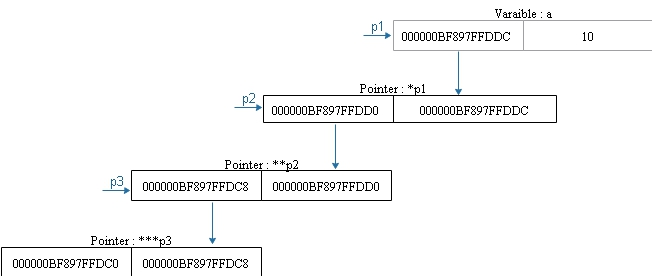

# Pointers in C

A pointer in C is a special type of variable that stores the memory address of another variable. This powerful construct enables indirect access and manipulation of data, making it a cornerstone of efficient and flexible programming in C. Pointers are defined using the * operator and can reference any data type. Pointers facilitate functions to directly modify variables passed as arguments by referencing their memory addresses, enhancing performance and reducing memory overhead. Despite their utility. 

### Syntax of defining a pointer:
> data_type * pointer_name = &variable_to_point
### Operators for pointers:

           

|  **Operator** | **Purpose**                                   | 
|---------------|---------------                                | 
|       *       | Specifies that it is a ponter                 | 
|       &       | Return the address of the operand variable    | 

To clear any confusions let us conside the following code

```c
int b = 10;
int *a = &b; 
```

Thus, 
>a -> Pointer\
>b -> Integer Variable


| **Expression**   | **Explanation**                                                                          | **Value/Result**       |
|----------------|---------------------------------------------------------------------------------         |------------------------|
| `*a`           | Dereferences `a` to get the value stored at the address it points to (the value of `b`). | `10`                   |
| `&a`           | Gets the address of the pointer `a` itself.                                              | Address of `a`         |
| `a`            | The value of the pointer `a`, which is the address of `b`.                               | Address of `b`         |
| `*b`           | Invalid operation. `b` is an `int`, not a pointer, so dereferencing it is not allowed.   | **Compilation error**  |
| `&b`           | Gets the address of the variable `b`.                                                    | Address of `b`         |
| `b`            | The value of the variable `b`.                                                           | `10`                   |


*The table sumarises the various results of combining the opreators with the variables.*

## Types of Pointers


### Constant Pointers
The pointer itself is constant, meaning it must always point to the same memory address after initialization.

**Syntax**
```c
int *const ptr;
```
- ptr is a constant pointer to an integer.
- You can modify the value at the memory location being pointed to, but you cannot change what ptr points to.

> Refer to constantPointer.c for examples and implementation

**In a Nutshell**
- You <u>**cannot**</u> modify the value being pointed to (*ptr = ... is invalid).
- You <u>**can**</u> change the pointer to point to another variable.

### Constant Value Pointer
The **value** pointed to by the pointer is constant and cannot be modified through the pointer.

**Syntax:**
  ```c
  const int *ptr;
```
- `ptr` is a pointer to a constant integer.
- You cannot change the value of the integer using `ptr`, but `ptr` can point to a different memory address.


**In a Nutshell**

- You <u>**cannot**</u>  modify the value being pointed to (`*ptr = ...` is invalid)
- You <u>**can**</u> change the pointer to point to another variable.

## Functions and Pointers

The pointers can be used with function in various files.
The below table summarizez the topic and the file where the concept is explained.

| Concept           | File          |
|-------------------|---------------|
Function Name as pointer | `funcNameAsPointer.c`
Function pointer         | `functionPoinnter.c`
Functions returning pointers | `funcReturnPointer.c`
Function Pointers as arguments | `funcPointersAsArguments.c`
Functions in a pointer array | `funcPointerArray.c`

## Array and Pointers
Arrays and pointers have a close connection and come in handy very often. For example array names can be considered as constant pointers pointing to the first element of the array.
The below table summarizes the various concepts covered and the file that contains the examples in implementation

| Concept                | File                 |
|------------------------|----------------------|
Array name as pointer    | `arrayNameAsConstPointer.c`
Array as pointers        | `arrayAsPointer.c`
Accessing array elements using pointers | `arrayElementsUsingPointers.c`
Arrays Vs Pointer          | `arrayVsPointers.c`

### Array Vs Pointers
The array variable and a pointer may look similar when looked at vaguely, but in deep there are quite some diffrence between them as summarized by the table below.

Consider the following code:
```c
char *a = "Hello";  // *a is a pointer
char b[] = "Hello"; // b is a array variable
```
| Pointer(`'a'`)                       | Array Variable (`'b'`)     |
|--------------------------------------|----------------------------|
`a` is a pointer  | `b` is a varible name for an array
pointer size is **8** | sizeof(b) = **6**
`a` and `&a` are diffrent | `b` and `&b` are same
a is at the stack memory but "Hello" is stored at the code section of memory |`"Hello"` is stored in the stack
`a = "Hello"` is valid also an address | `b = "Hello"` is not valid
`a++` is valid | `a++` is invalid
`a[1] = 'A'` is invalid, code section is read only memory. | `b[1] = 'A'` is valid


## Multiple Pointers

Instead of pointers, pointing only a varaible, they can also point to another pointer. It might sound confusing but actually it is a very intreasting application. Let us consider an example.

```c

int a = 10;
int *p1 = &a;
int **p2 = &p1;
int ***p3 = &p2;

```
The below diagram depicts how they are internally mapped. The left side box contains the address of that entity (variable / pointer), and the right side box stores the value of the entity (variable / pointer).




It can be seen that as the pointer `p1` points to the variable `a`, so the value stored in the `p1` pointer is the address of the variable `a`. The pointer `p2` points to the pointer `p1`, so the value of the pointer p2 is the address of the pointer `p1`. The same applies for the pointer `p3` as well. 

The detailed implemtentation and explanation can be found from the file `multiplePointers.c`

## Memory Types in C


### 1. Code Memory:

It is read only memeory type that stores the complied code, that is the machine code that the CPU uses for executing tasks of the program. The read-only property of this memory prevents the data being modified, thus protecting the integriy of the program.

**Charaacteristics**
- Contians the instructions for user-defined functions
- contains string literals used in the program
- It is shared among process running the same program to save memory

### 2. Stack Memeory:
The stack memory stores function calls and local variables in a program. This memory shrinks and extends dynamically as per requirement. 

**Characteristic**
- Memory is managed automatically
- Follows LIFO - Last in First Out
- Limited memory may lead to stack overflow error.

### 3. Heap Memory:

This is the memory segment used for dynamic memory allocation, using in-built functions `malloc()`, `calloc()`, `realloc()` and `free()`

**Characteristics**
- The programmer is the person who is responible for allocating and freeing the heap memory.
- variable are stored here if they are needed in a braoder scope, that is beyond a function. 
- If not managed properly may lead to memory leaks

**Memory Leak**
- Happens when a data is stored in the heap, but the programmer did not free it from the heap.
- This leads to the data to be `orphaned`, and that memory location cannot be used further.
- If this accumulates, overtime this may slow down the program sometimes it may even crash.
  

| Feature           | Stack             |Heap               |
|-------------------|-------------------|-------------------|
Memory    | Small and limited   | Large and flexible
Speed     | Fast - Managed by CPU | Slower - Managed by OS\
Lifetime  | Automatic             | User defined
Allocation| Static               | Dynamic
Error     | Stack Overflow       | Memory Leak

*Table summarizing the key diffrences between Stack and Heap*


*Visualizes the various memory spaces available in C*